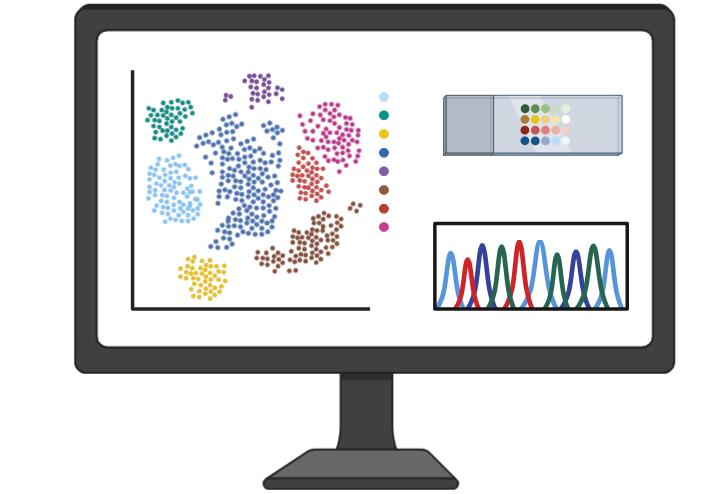
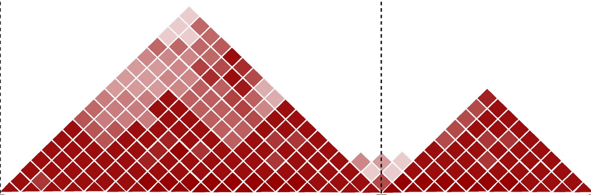
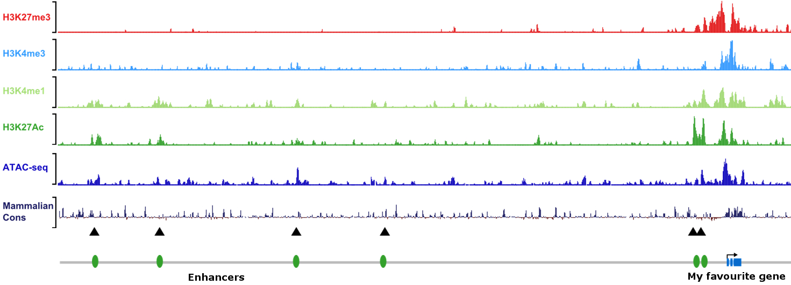
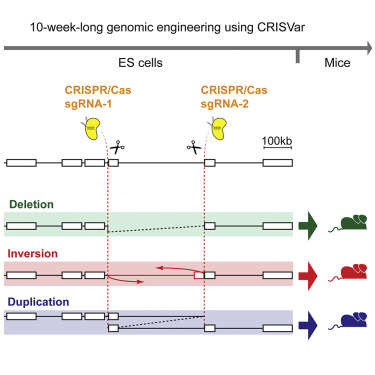

# Research

##  3D CHROMATIN ORGANIZATION

To trigger gene expression, regulatory elements are physically brought into the vicinity of promoters in a process called “looping”. Although the process of gene transcription has been largely studied, the principles of how regulatory elements engage in loops and find their appropriate partner, often ignoring other nearby genes, are still largely unknown.

The study of the 3D organization of genomes through Chromosome Conformation Capture (3C) and derivatives (for a review, see de [de Wit and de Laat, 2012](https://www.ncbi.nlm.nih.gov/pubmed/22215806)) revealed that these enhancer-promoter associations are usually confined within Topologically Associating Domains (TADs). These megabase-sized domains represent broad DNA regions containing loci that interact more frequently with themselves than with the rest of the genome ([Dixon et al., 2012](https://www.ncbi.nlm.nih.gov/pubmed/22495300); [Nora et al., 2012](https://www.ncbi.nlm.nih.gov/pubmed/22495304)). TADs display a high degree of overlap with previously described regulatory landscapes where enhancers are able to exert their influence. Based on this, it was speculated that TADs represent fundamental genomic modules that facilitate regulatory elements to find their cognate promoters. 

We were among the first to demonstrate that TADs are biologically relevant: the disruption of their boundaries may cause these structures to intermingle, causing novel associations between otherwise segregated enhancer and promoter pairs ([Lupiáñez et al., 2015](https://www.ncbi.nlm.nih.gov/pubmed/25959774); [Bianco et al., 2018](https://pubmed.ncbi.nlm.nih.gov/29662163/)). Such interactions can result in aberrant patterns of gene expression and induce congenital malformations or cancer ([Lupiáñez et al., 2016](https://www.ncbi.nlm.nih.gov/pubmed/26862051); [Anania et al., 2020](https://pubmed.ncbi.nlm.nih.gov/29692413/)). Moreover, we recently showed that changes in TAD organization can also serve as a substrate for the evolution of novel phenotypes, such as the intersexuality of female moles ([Real et al., 2020](https://pubmed.ncbi.nlm.nih.gov/33033216/)) or the enlarged fins of skates ([Marlétaz et al., 2023](https://pubmed.ncbi.nlm.nih.gov/37046085/)).

In ongoing projects, we seek to decipher developmental principles of 3D chromatin organization ([Anania et al., 2022](https://pubmed.ncbi.nlm.nih.gov/35817979/)) and to understand how they may have evolved ([Acemel et al., 2023](https://pubmed.ncbi.nlm.nih.gov/36603519/)).



## SEX DETERMINATION

In vertebrates, both testes and ovaries derive from a common precursor organ: the bipotential gonad.

In mammals, sex determination is triggered by the early expression of either SRY in the bipotential XY gonad, or its absence in the XX counterpart (for a review, see [Capel, 2017](https://www.ncbi.nlm.nih.gov/pubmed/28804140)). Upon commitment of the gonad to a specific fate, a complex genetic and hormonal cascade induces alterations on cell identity, on tissue structure, and, ultimately, a series of anatomical and behavioral changes in the entire organism.

Although the outcome of sex determination is conserved across species, the mechanisms of sex determination are astonishingly plastic. There is not an initiator of sex differentiation that is universal for all species. Input signals are rather variable and controlled by genetic (GSD) or environmental mechanisms (ESD), or by a combination of both. The evolutionary advantages that result from such a plastic system are still uncertain, but could be related to a certain degree of phenotypical variance within male and female categories, which may be highly adaptive in changing environments, as long as there are two compatible sexes.

In ongoing projects, we aim to understand the molecular sources of the evolutionary plasticity of sex determination. For this purpose, we are profiling and comparing the process of sex determination in a wide range of vertebrate species to identify sources of genomic and regulatory variation. We are particularly interested in evaluating the potential role of 3D chromatin organization ([Mota-Gómez et al., 2022](https://www.biorxiv.org/content/10.1101/2022.11.18.516861v1)) and identifying novel regulators of sex determination ([Hurtado et al., 2023](https://www.nature.com/articles/s41467-024-47658-x)).



## 🧪 METHODS
Discover the daily techniques and methodologies we use in our lab:

  

    
    <strong>Single-cell omics (scRNA-seq, scATAC-seq)</strong>
  

  
We apply single-cell RNA-seq and ATAC-seq to dissect gene expression and chromatin accessibility at the single-cell level, enabling the reconstruction of cell-type-specific regulatory landscapes.

---

  

    
    <strong>Quantification of chromatin interactions (4C-seq, Hi-C, capture-Hi-C, promoter capture-C)</strong>
  

  
  
The development of Chromosome Conformation Capture (3C) made possible the study of the 3D architecture of the genome by quantifying chromatin looping via a proximity ligation assay. This has greatly expanded our knowledge about gene regulation unfolding basic principles of genomic organization such as the existence of Topologically Associating Domains (TADs).  
  In our lab, we use specific derivatives of the original technique to identify all interacting partners of a specific locus across the genome (4C-seq) or to study every possible contact happening in the nucleus (Hi-C). In addition, we couple C-technologies oligo-based capture technology to investigate multiple loci in the same experiment (Promoter Capture-C) or to create high-resolution interaction maps of large genomic regions (Capture Hi-C).

---

  

    <i class="fas fa-chevron-down" style="margin-right: 10px;"></i><strong>Identification of regulatory elements (ChIP-seq, ATAC-seq)</strong>
  

  
We use a combinatorial approach to identify regulatory elements. In a first instance, we generate ChIP-seq datasets in a specific tissue for the histone marks H3k4me1 (marking enhancers), H3K4me3 (promoters), H3K27Ac (active) and H3K27me3 (repressed). We complement this with ATAC-seq datasets to identify open chromatin regions as well as mammalian conservation. Altogether, we use this information to segment the genome into functional categories for the studied tissue using EpiCSeg (<a href="https://genomebiology.biomedcentral.com/articles/10.1186/s13059-015-0708-z" target="_blank">Mammana et al., 2015</a>). Regulatory elements (more specifically enhancers) are then evaluated for their reporter activity in vivo or functionally tested via genome editing.

  

    
  

---

  
<strong>✂️ Genome editing (CRISPR/Cas on mouse ES cells)</strong>

  
The recent adaptation of the bacterial immune system CRISPR/Cas9 for genome engineering has revolutionized the field of genetics by allowing a fast, cheap and precise tool to manipulate genomes. Recently we reported our own adaptation of this system to generate mice carrying structural variations, like deletions, duplications or inversions, ranging from hundreds bp to a few megabases (Kraft et al., 2015). In our system, mouse embryonic stem cells (mESC) are transfected with plasmids coexpressing the endonuclease Cas9 and specific guides RNAs flanking the region where the rearrangement has to be induced. We have successfully applied this method in several loci to create mouse models for human disease (<a href="https://pubmed.ncbi.nlm.nih.gov/25959774/" target="_blank">Lupiáñez et al., 2015</a>); <a href="https://pubmed.ncbi.nlm.nih.gov/26755636/" target="_blank">Spielmann et al., 2016</a>. In summary our CRISPR/Cas9 system provides a valuable, fast and reliable tool to systematically manipulate selected loci.

  

      

---

  
<strong>🐭 Generation of transgenic animals (tetraploid complementation assay)</strong>

  
We use our CRISPR-edited mouse ES cells to generate mutant mice via tetraploid complementation assay. This technology, in contrast to other methods (see picture), allows the generation of embryonic litters with isogenic genotypes and ensures a nearly 100% contribution of our mutant cells in the resulting embryo. This allows the direct phenotypical analysis of the resulting F0 animals, thus avoiding breeding steps, generation of stable lines and drastically reducing the number of animals required.

  

    
  

